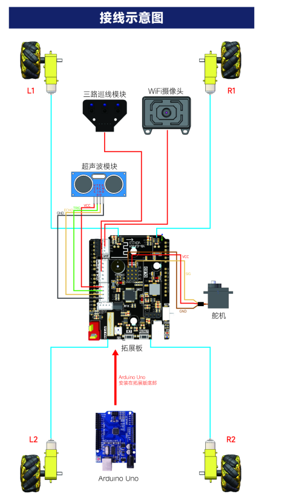
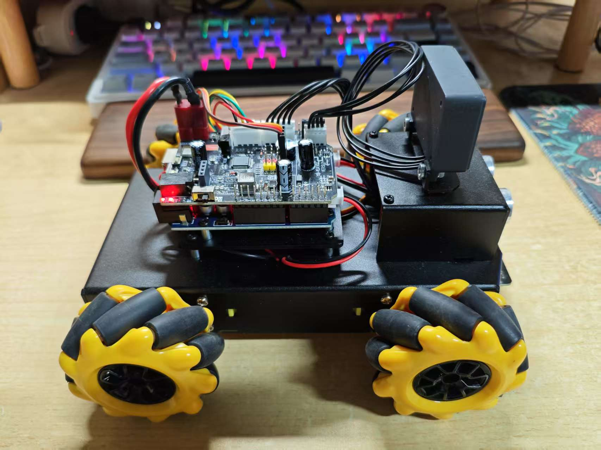

# VisionCruise‑V1 — README（Day 0）

> 本仓库用于七牛云嵌入式赛题三
> 队名：视界循迹（单人）

---

## 1. 目录

```
VisionCruise‑V1/
├─ README.md
├─ 如何运行程序的说明.md
├─ 架构设计文档.md
├─ 录制的demo视频.mp4
└─ Car_tracking_Avoid/
   └─ Car_tracking_Avoid.ino
└─ ESP32_S3/
   └─ ...
```

---

## 2. 目标

* 沿 1 cm 黑胶带的圆环行驶，半径约 1 m。
* 行进中遇到小障碍物能绕开后继续前进。
* 上电放在起点白标处，先原地旋转约一圈，看到黑线后进入循迹。
* 断线时支持最小的“扫描—重获—继续”流程。相机与图传属于加分项，后期再加。

---

## 3. 硬件

* Arduino UNO‑Pro
* 三路反射式循迹模块
* 超声波测距模块
* Wi‑Fi 摄像头模块 ESP32‑S3固件
* 电机驱动板与车体

**接线图**



**实拍图**



---

## 4. 使用方法

1. 烧录前先拔掉摄像头与 UNO 的串口连接。烧好再插回。
2. 上电后串口会输出一行自检信息：

   ```
   LINE L=__ M=__ R=__ | ULTRA=__cm | CAM 320x240 FPS=__ | FW v1.0.0
   ```
3. 把车放在起点白标。上电后原地缓慢旋转，识别到黑线即停止旋转并开始循迹。
4. 跑完一圈再次回到起点后鸣笛或停车。

---

## 5. 控制流程

* `SPIN_FIND`：上电旋转找线。
* `TRACK`：三路循迹差分控制。
* `AVOID`：超声近距离时减速或绕开。
* `SCAN / REACQUIRE`：断线后小角速度扫描，看到线后小速度对正，再回到循迹。
* `FINISH`：回到起点后结束。

---

## 6. 默认参数（现场再调）

* 减速距离 30 cm。
* 刹停距离 15 cm。
* 基础速度 90（PWM）。
* 启动旋转角速度 60。旋转范围约 350° 到 370°。
* 相机判定阈值与容差后续根据场地调整。

---

## 7. 测试清单

* 起点找线后开始循迹。
* 圆环跑一圈回到起点后停止或鸣笛。
* 圆环上放置小障碍能绕开后继续。
* 圆环剪出约 15 cm 缺口能扫描并跟踪。

---

## 8. 可见性与提交

* 9 月 23 日起每天提交。
* 9 月 30 日 23:59 前仓库可以私有，10 月 1 日 00:00 需要公开。

### 每日工作内容（实际+计划）

| Day  | 日期   | 主要内容                              |
| ---- | ---- | --------------------------------- |
| Day0 | 9/22 | 建仓，提交 README，             |
| Day1 | 9/23 | 提交目录和空工程；提交接线图                |
| Day2 | 9/24 | 提交巡线代码、遇障停止；提交实物图       |
| Day3 | 9/25 | 提交遇障绕行，起点转270度巡线代码            |
| Day4 | 9/26 | 提交遇障绕行后回线检测代码              |
| Day5 | 9/27 | 提交完整跑圈与起点识别，障碍物演示视频               |
| Day6 | 9/28 | 文档整理，补充参数和截图，上传合成演示视频             |
| Day7 | 9/29 | 提交断线扫描/重获的代码与演示，完善日志              |
| Day8 | 9/30 | 提交最终版，参数表和完整 demo 视频，打 tag，仓库设为公开 |

> 每天至少 1–2 次 commit，可以是代码、参数、截图或短视频链接。
